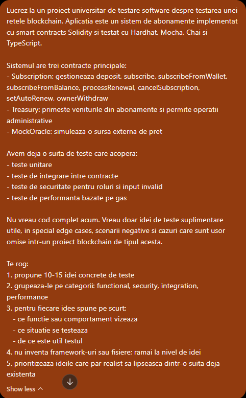
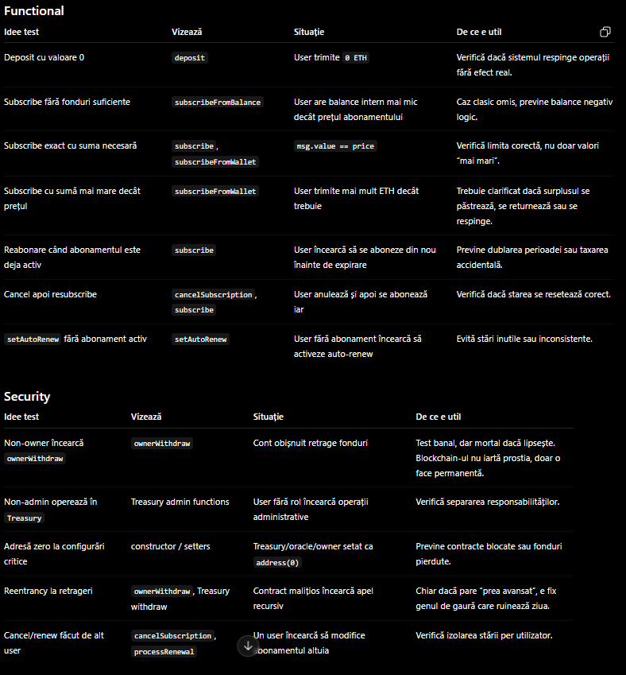
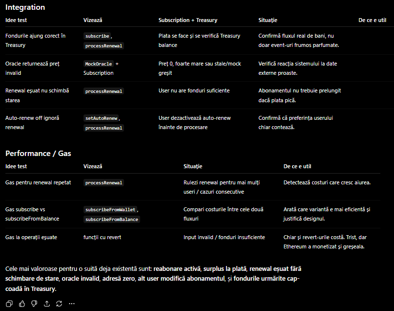
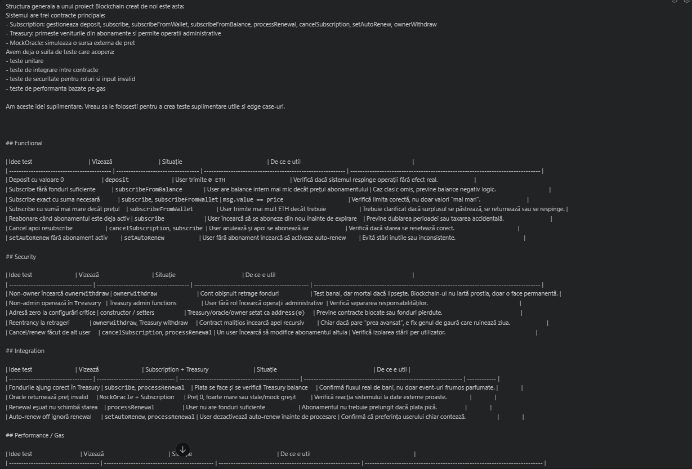
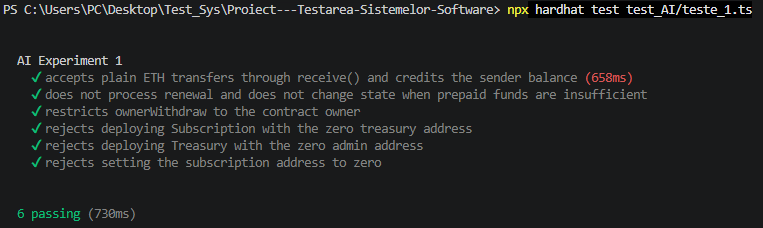
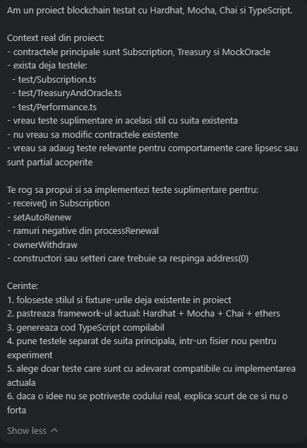
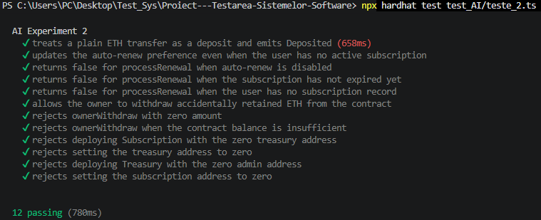

# AI Report for Test Generation

## Purpose of the report

This report documents how AI tools were used in the testing process of the current blockchain project.

The goal was not to replace the team-written test suite, but to evaluate how useful AI can be in two different situations:

- when it is asked to suggest tests based on a general description and only minimal context;
- when it is given direct access to the real project context and asked to generate more targeted tests.

The purpose of the comparison is to observe the differences between vague AI-assisted testing and context-aware AI-assisted testing, and then compare both of them with the existing team-written test suite.

## Project context

The tested application is a blockchain subscription system built around three smart contracts:

- `Subscription`
- `Treasury`
- `MockOracle`

The existing project already contains a working automated test suite written with `Hardhat`, `Mocha`, `Chai` and `TypeScript`.

That suite covers the testing directions required by the project theme:

- unit testing;
- integration testing;
- security testing;
- performance testing.

The existing test suite runs successfully and is the baseline used for comparison in this report.

## Experiment design

The AI analysis was organized into two experiments.

## Experiment 1: vague ideas + minimal context

In the first experiment, `ChatGPT` was used mainly for exploratory support:

- suggesting missing test ideas;
- proposing edge cases;
- generating rough testing boilerplate.

### Prompt used:

### Response:

### After that, `Codex` was used to turn those ideas into actual tests, but with only minimal context.

### The prompt given to Codex was the answer from ChatGPT, with the added context of the project(also given to ChatGPT):

#### Response was a code that was put into \PROIECT---TESTAREA-SISTEMELOR-SOFTWARE\test_AI\teste_1 that was then ran with the command `npx hardhat test test_AI/teste_1.ts`. The result is "6 passing".

#### The idea behind this experiment was to simulate a weaker AI-assisted workflow, where the tools receive only a limited description of the project and of the target functionality.

---

## Experiment 2: direct generation with real project context

In the second experiment, `Codex` was asked directly for both test ideas and implementation, but this time using the real context of the repository:

- existing contracts;
- current test files;
- actual naming and structure from the project;
- the intended style of the existing suite.

### Prompt used:

### Response was a code that was attached into PROIECT---TESTAREA-SISTEMELOR-SOFTWARE\test_AI\teste_2, that was then ran with the command `npx hardhat test test_AI/teste_2.ts` and resulted in "12 passing". The generated tests were more complete than in Experiment 1 and matched the real structure of the project more closely. In particular, the suite covered multiple negative paths for `processRenewal`, administrative validation for `ownerWithdraw`, and `address(0)` checks for constructors and setters. This suggests that direct repository context helped the AI produce tests that were more relevant and easier to integrate.

#### The purpose of this experiment was to evaluate whether context improves relevance, correctness and integration with the current codebase.

## Observations

The tests generated in Experiment 1 were useful as a starting point, but they remained relatively narrow in scope. Most of them were basic validation checks and simple negative scenarios, which made the suite usable, but less complete than a context-aware one.

In Experiment 2, access to the real project context led to a more complete and better targeted suite. The generated tests included more negative branches, more precise administrative checks and behavior that matched the actual implementation more closely.  

To keep the experiments isolated from the main project suite, the generated tests were stored separately in `\test_AI`.

## Comparing Experiment 1 vs Experiment 2

The first comparison concerns the effect of context on the generated tests.

In `Experiment 1`, the workflow was indirect: `ChatGPT` first suggested ideas, then `Codex` transformed those ideas into code with only limited project context. This produced a usable result, but the suite remained relatively small and focused mostly on straightforward validation scenarios such as `receive()`, access control for `ownerWithdraw`, insufficient renewal balance and zero-address checks.

In `Experiment 2`, `Codex` received the real repository context directly. Because of that, the generated tests were broader and more consistent with the existing project structure. The second suite covered more branches of `processRenewal`, included more precise administrative validation and matched the style of the existing fixtures and assertions more closely.

This difference can also be seen in the size and depth of the resulting suites:

| Criterion | Experiment 1 | Experiment 2 |
| --------- | ------------ | ------------ |
| AI workflow | `ChatGPT` ideas + `Codex` implementation | `Codex` with direct repository context |
| Context available | Minimal | Real project context |
| Generated file | `test_AI/teste_1.ts` | `test_AI/teste_2.ts` |
| Tests passing | `6/6` | `12/12` |
| Scope | basic missing checks | broader missing checks |
| Negative branches | limited | more complete |
| Alignment with existing suite | moderate | high |
| Reusability | useful starting point | more directly reusable |

Overall, `Experiment 1` showed that vague AI-assisted workflows can still produce useful tests, but mostly at the level of a starting draft. `Experiment 2` showed that once the AI receives the real context of the repository, the generated tests become more relevant, more complete and easier to integrate into the project.

## AI-generated tests vs team-written suite

Although `Experiment 2` performed better than `Experiment 1`, both AI-assisted suites were still secondary when compared with the team-written test suite already present in the repository.

The reason is that the existing suite was not built around isolated extra checks, but around the main requirements of the project theme. It already covers the core blockchain testing directions required for `T8`:

- unit testing;
- integration testing between contracts;
- security testing for access control and invalid input;
- performance testing through gas measurements.

By contrast, the AI-generated suites mainly helped extend the project with additional checks for behaviors that were missing or only partially covered. In other words, the AI-assisted tests were useful for refinement, while the team-written suite remained the main structured testing effort.

The difference can be summarized as follows:

| Criterion | Experiment 1 | Experiment 2 | Team-written suite |
| --------- | ------------ | ------------ | ------------------ |
| Main purpose | exploratory extension | context-aware extension | full project validation |
| Number of tests | `6` | `12` | `16` |
| Result | `6 passing` | `12 passing` | `16 passing` |
| Coverage style | selected edge cases | broader edge cases and negative flows | core functional, integration, security and performance coverage |
| Knowledge of project structure | limited | strong | complete |
| Role in project | support | support | baseline reference |

Another useful way to compare them is by looking at the types of behaviors covered:

| Test area | Experiment 1 | Experiment 2 | Existing suite |
| --------- | ------------ | ------------ | -------------- |
| `receive()` | yes | yes | no |
| `setAutoRenew` | no | yes | no |
| negative `processRenewal` branches | partial | yes | partial |
| `ownerWithdraw` | partial | yes | no |
| zero-address validation | yes | yes | no |

This shows that the AI-generated tests were not useless or redundant. On the contrary, they were helpful in identifying and implementing missing checks around narrower behaviors. However, they did not replace the need for a deliberately designed suite centered on the main system flows.

## Interpretation and conclusion

The two experiments suggest that AI is most useful when it is treated as a support tool, not as a replacement for test design.

`Experiment 1` showed that even a weaker workflow can still produce useful output. `ChatGPT` was helpful for brainstorming missing scenarios, and `Codex` was able to transform some of those ideas into executable tests. However, the result remained relatively narrow and closer to a first draft than to a complete extension of the project suite.

`Experiment 2` showed a clear improvement once the real repository context was provided. The generated tests became more precise, more aligned with the actual implementation and more consistent with the style already used in the project. This confirms the same general lesson visible in other AI testing reports: context improves the quality of the output substantially.

At the same time, the team-written suite remained the strongest part of the project. It was the only one designed from the start around the actual requirements of blockchain testing: contract interaction, role restrictions, invalid input, time-dependent behavior and gas-based performance checks. The AI-generated suites improved the project around the edges, but they did not define its core validation strategy.

The final conclusion is therefore balanced:

- `ChatGPT` was useful for exploratory ideas and missing-case discovery;
- `Codex` was more useful when real repository context was provided;
- AI-assisted tests were valuable as extensions;
- the team-written suite remained the main and most reliable testing reference.

In this project, AI worked best not as an automatic replacement for the testing process, but as a complementary tool that helped discover and implement additional useful checks around an already solid manual test suite.
