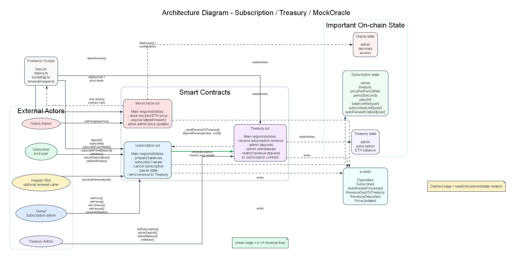
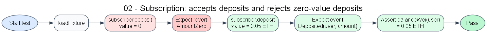
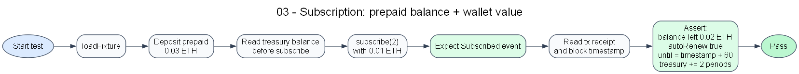
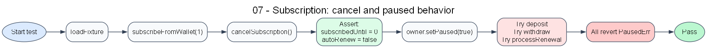
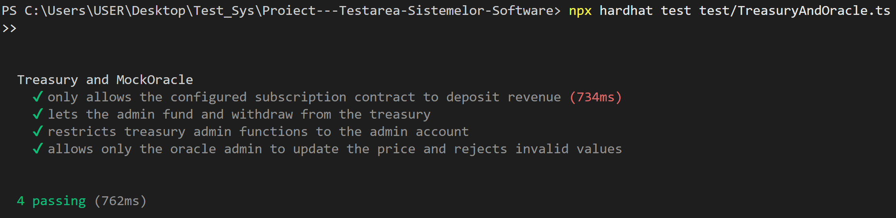
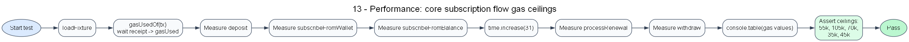
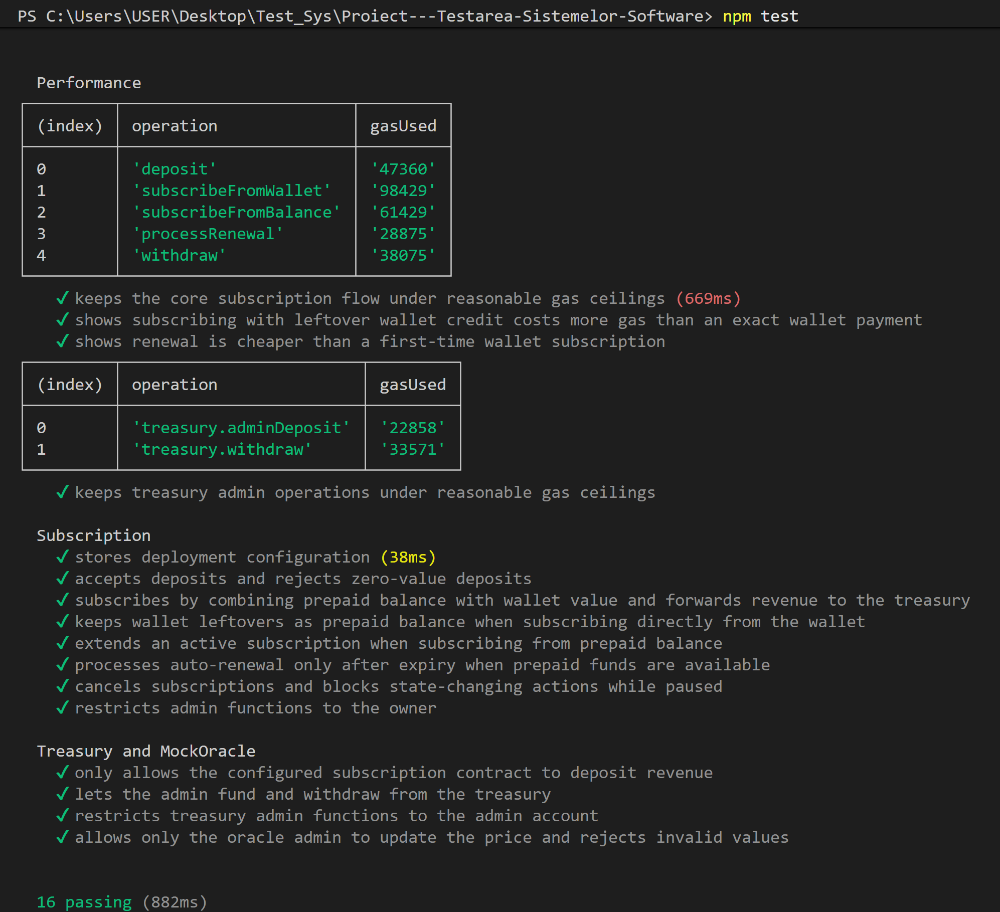

# Testing a Blockchain Application Using Hardhat

The purpose of this project is testing a blockchain application using a modern Ethereum development stack, in order to cover the main testing directions required by the course: **unit testing, integration testing, security testing and performance testing**.

The application under test is a subscription system implemented with smart contracts. Because blockchain applications handle funds and permanent state changes, testing is the most important part of the project. For that reason, this documentation focuses mainly on the test strategy, the tested flows and the interpretation of the results.

## Presentation

- [Project summary](blockchain.md)
- `project presentation`

## Reports

- `video demo running the application`
- `video demo running the tests`
- `screenshots with test execution`
- `AI report`

## Testing environment

Before deciding the testing stack, the most relevant options for a Solidity-based project were the following:

### Framework comparison

| Framework | Description |
| --------- | ----------- |
| **Hardhat** | A complete Ethereum development environment with strong support for local networks, scripting, automated testing and debugging. |
| **Foundry** | A fast Rust-based toolkit for Solidity development, popular for low-level smart contract testing and fuzzing. |
| **Truffle** | A classic Ethereum development framework, historically important, but used less often in newer projects than Hardhat or Foundry. |

### Comparison of key features

| Feature | Hardhat | Foundry | Truffle |
| ------- | ------- | ------- | ------- |
| Ease of setup | High | Moderate | High |
| Local blockchain support | Excellent | Good | Good |
| TypeScript integration | Excellent | Limited | Moderate |
| Testing ecosystem | Excellent | Excellent | Good |
| Debugging support | Excellent | Good | Moderate |
| Community adoption in current tutorials | High | High | Lower |

For the purpose of this project, we chose **Hardhat** because it offers a clear local blockchain environment, integrates naturally with **Mocha**, **Chai** and **ethers**, and makes it easy to write readable automated tests in **TypeScript**.

The software environment used in the current project is:

| Component | Version / Technology |
| --------- | -------------------- |
| Node.js | `v22.17.0` |
| npm | `10.9.2` |
| Hardhat | `^2.22.3` |
| Solidity | `0.8.26` |
| Mocha | `^11.7.5` |
| Chai | `^4.3.10` |
| ethers | `^6.16.0` |

The project was tested on a **local Hardhat blockchain**, so no real funds and no public network were involved.

## Program description

### Blockchain subscription system

The application models a subscription platform with prepaid balance, wallet payments, revenue collection and automatic renewal.

The system contains three smart contracts:

- `Subscription` - the main contract, responsible for deposits, subscriptions, renewals and subscription state;
- `Treasury` - the contract that receives the revenue paid for subscriptions;
- `MockOracle` - a simple mock contract used to simulate an external price source.

### Tested contracts and flows

For testing in this project, we did not choose only one isolated function. Instead, we focused on the **core flows** that define the application behavior:

- user deposit into `Subscription`;
- subscription from wallet;
- subscription from prepaid balance;
- subscription using both wallet funds and internal balance;
- automatic renewal after expiry;
- transfer of revenue to `Treasury`;
- treasury admin operations;
- oracle admin operations;
- rejection of unauthorized or invalid calls.

This was necessary because, unlike a small single-method application, a blockchain system is defined not only by the correctness of individual functions, but also by the way contracts interact with each other.



## Functional testing

Functional testing in this project focuses on validating the expected behavior of the subscription system from the user and administrator perspectives.

### Writing equivalence classes

The most important behaviors can be grouped into the following input classes.

#### 1. Deposit amount

- `D_1` = `0`
- `D_2` = `> 0`

Expected outputs:

- `OD_1` = transaction reverted with `AmountZero`
- `OD_2` = balance updated and `Deposited` event emitted

#### 2. Subscription payment source

- `S_1` = wallet only
- `S_2` = prepaid balance only
- `S_3` = prepaid balance + wallet
- `S_4` = insufficient total funds

Expected outputs:

- `OS_1` = subscription activated, revenue sent to treasury
- `OS_2` = subscription activated, internal balance reduced
- `OS_3` = subscription activated, balance partially consumed, revenue sent to treasury
- `OS_4` = transaction reverted with `InsufficientFunds`

#### 3. Renewal state

- `R_1` = auto-renew disabled
- `R_2` = subscription not expired yet
- `R_3` = expired, but insufficient prepaid balance
- `R_4` = expired and sufficient prepaid balance

Expected outputs:

- `OR_1` = renewal not processed
- `OR_2` = renewal not processed
- `OR_3` = renewal not processed
- `OR_4` = renewal processed, new end time stored, revenue sent to treasury

#### 4. Caller permissions

- `P_1` = authorized owner / admin / configured subscription contract
- `P_2` = unauthorized caller

Expected outputs:

- `OP_1` = operation allowed
- `OP_2` = operation reverted with `NotOwner`, `NotAdmin` or `NotSubscription`

These classes are reflected directly in the implemented test suites.

### Functional test cases



The following table summarizes the most representative functional cases:

| Case | Scenario | Expected behavior |
| ---- | -------- | ----------------- |
| `C_1` | deposit with `0` ETH | reverted with `AmountZero` |
| `C_2` | deposit with positive value | balance updated |
| `C_3` | subscribe from wallet with exact payment | subscription activated |
| `C_4` | subscribe from wallet with extra payment | subscription activated, leftover stored in balance |
| `C_5` | subscribe from prepaid balance | subscription activated, balance reduced |
| `C_6` | subscribe with prepaid balance + wallet | both sources combined correctly |
| `C_7` | subscribe with insufficient funds | reverted with `InsufficientFunds` |
| `C_8` | process renewal before expiry | returns `false` |
| `C_9` | process renewal after expiry with enough funds | renewal processed |
| `C_10` | process renewal after expiry without enough funds | renewal not processed |
| `C_11` | unauthorized treasury depositRevenue call | reverted with `NotSubscription` |
| `C_12` | unauthorized admin call | reverted with role-specific custom error |

### Boundary value analysis

Boundary value analysis was especially relevant for values that control contract state transitions.

#### 1. Monetary values

- `0` ETH
- exact subscription price
- subscription price + leftover
- value smaller than required price

These boundaries are important because they separate:

- valid payment from invalid payment;
- full payment from insufficient payment;
- exact payment from payment that creates prepaid credit.

#### 2. Subscription periods

- `0` periods
- `1` period
- multiple periods

This boundary is important because `0` is invalid, while `1` and values above `1` trigger valid subscription logic.

#### 3. Time-related renewal states

- current time `< subscribedUntil`
- current time `= subscribedUntil` or just after expiry

This boundary is important because `processRenewal` must behave differently before and after expiration.

The implemented tests cover these boundary situations through exact-value and near-boundary scenarios.

## Performance, integration and security testing

### Test suite structure

The tests are organized in the following files:

| File | Main focus |
| ---- | ---------- |
| `test/Subscription.ts` | subscription logic, state transitions, pause behavior |
| `test/TreasuryAndOracle.ts` | inter-contract permissions, treasury flow, oracle restrictions |
| `test/Performance.ts` | gas consumption and comparative cost checks |

### Integration testing



The most relevant integration behavior in the project is the interaction between `Subscription` and `Treasury`.

When a user subscribes successfully:

1. the subscription cost is computed;
2. funds are collected from the wallet, internal balance, or both;
3. the subscription interval is updated;
4. revenue is sent to `Treasury`;
5. the final state is verified in tests.

This means the tests do not stop at checking one isolated variable. They verify the full contract-to-contract flow.

### Security testing



Security testing is essential in blockchain applications because invalid permissions or incorrect validations may directly affect funds.

In this project, the security-oriented tests verify:

- owner-only functions in `Subscription`;
- admin-only functions in `Treasury`;
- admin-only updates in `MockOracle`;
- rejection of zero-value or invalid operations;
- rejection of unauthorized revenue deposits;
- blocking of state-changing operations when the system is paused.

The goal of these tests is to show that the contracts are not only functional, but also protected against obvious misuse.

```ts
it("only allows the configured subscription contract to deposit revenue", async function () {
    const { other, subscriptionSigner, treasury } = await loadFixture(deployFixture);

    await expect(treasury.connect(other).depositRevenue({ value: 1n }))
      .to.be.revertedWithCustomError(treasury, "NotSubscription");

    await expect(treasury.connect(subscriptionSigner).depositRevenue({ value: ethers.parseEther("0.02") }))
      .to.emit(treasury, "RevenueDeposited")
      .withArgs(subscriptionSigner.address, ethers.parseEther("0.02"));
  });
  ```




## Performance testing



In blockchain applications, performance is strongly connected to **gas cost**. For this reason, the project includes a separate suite dedicated to gas usage.

The following operations were measured:

- `deposit`
- `subscribeFromWallet`
- `subscribeFromBalance`
- `processRenewal`
- `withdraw`
- `treasury.adminDeposit`
- `treasury.withdraw`

The tests also compare relevant scenarios:

- wallet subscription with exact payment vs. wallet subscription with leftover credit;
- first subscription vs. automatic renewal.

### Results summary

Running:

```bash
npm.cmd test
```

produced:

- **16 passing tests**
- **0 failing tests**

The gas values recorded during the current run were:

| Operation | Gas used |
| --------- | -------- |
| `deposit` | `47360` |
| `subscribeFromWallet` | `98429` |
| `subscribeFromBalance` | `61429` |
| `processRenewal` | `28875` |
| `withdraw` | `38075` |
| `treasury.adminDeposit` | `22858` |
| `treasury.withdraw` | `33571` |

### Interpretation

- `subscribeFromWallet` is the most expensive tested operation because it updates subscription state and forwards revenue;
- `subscribeFromBalance` is cheaper because no extra wallet-payment handling is needed;
- `processRenewal` is cheaper than a first-time wallet subscription, which is expected and desirable;
- treasury admin operations remain relatively small in cost.



## How the tests cover the project requirements

The current project covers the tests as follows:

| Requirement | Coverage in this project |
| ----------- | ------------------------ |
| Unit testing | direct checks for `Subscription`, `Treasury`, `MockOracle` behaviors |
| Integration testing | complete subscription and renewal flows across contracts |
| Performance testing | gas measurement and comparison between execution scenarios |
| Security testing | access control, invalid input rejection, pause protection |

## Running the tests

To run the test suite locally:

```bash
npm install
npm.cmd test
```

If the application needs to be shown manually, the local blockchain can be started separately with Hardhat, but the main focus of the project remains the automated test suite.

## AI report

`PLACEHOLDER: link to AI report`

`screenshots for prompt / answer / generated tests`

## Conclusion

This project is centered on testing a blockchain subscription application, not only on implementing one.

The final test suite shows that:

- the main contract logic behaves correctly;
- the interaction between contracts is validated;
- unauthorized operations are rejected;
- the important blockchain operations have measurable and reasonable gas costs.

For this reason, the strongest part of the project is the testing layer, which demonstrates correctness, safety and efficiency from multiple angles.

## References

[1] Hardhat Documentation, https://hardhat.org/docs,   
[2] Mocha Documentation, https://mochajs.org/,  
[3] Chai Documentation, https://www.chaijs.com/,  
[4] ethers.js Documentation, https://docs.ethers.org/,  
[5] OpenAI, ChatGPT, https://chatgpt.com/ 